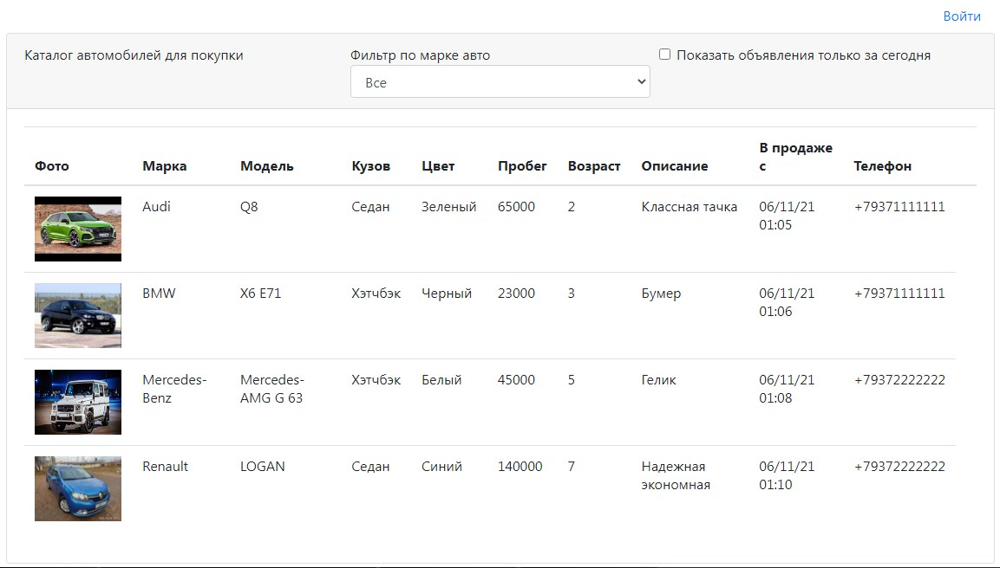
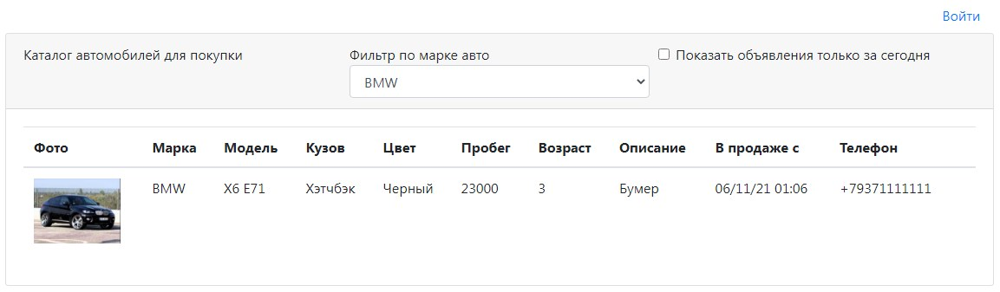
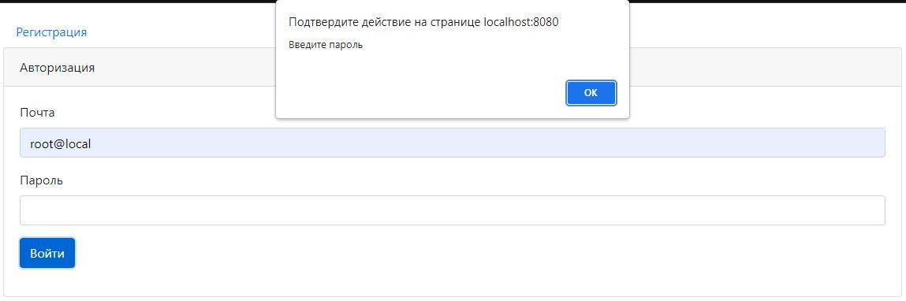
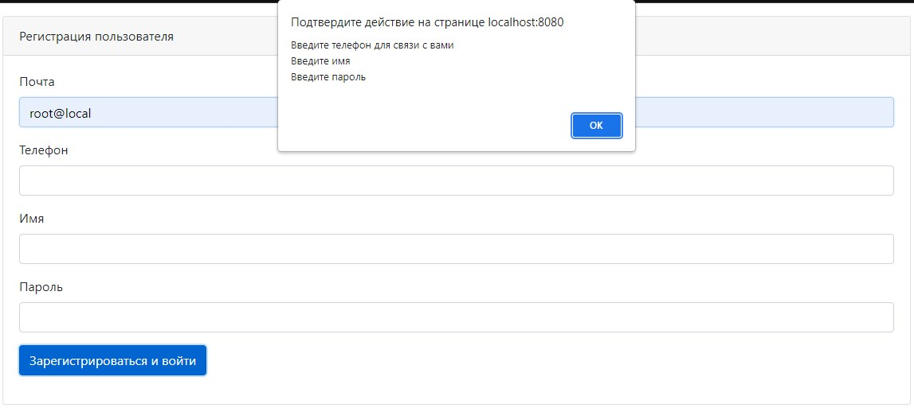
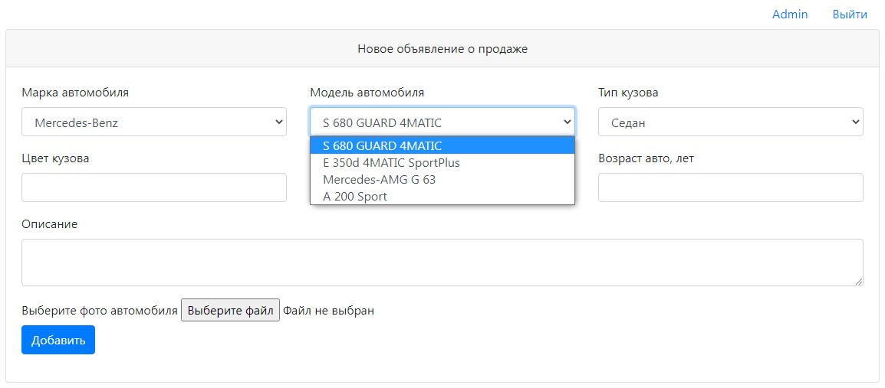
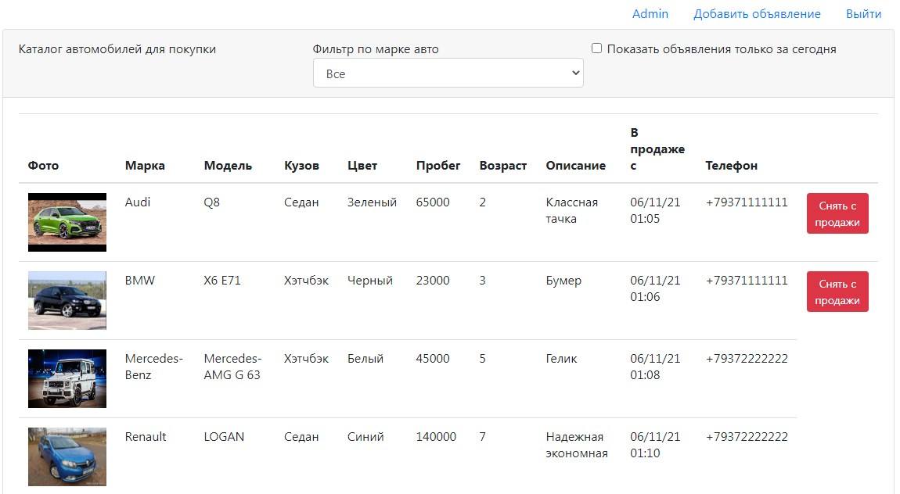

# job4j_cars

Данный проект представляет собой площадку для купли/продажи автомобилей.
Добавлять новые объявления могут только авторизованные пользователи.
Снять объявление с продажи может только автор объявления.
Просматривать объявления могут все, для этого авторизация не нужна.
При добавлении объявления, требуется ввести технические характеристики
продаваемого автомобиля, так же есть возможность добавить фотографию.

В данном проекте применены технологии: Hibernate, Bootstrap, Servlet,
шаблон MVC, PostgreSQL, H2, JavaScript, AJAX, JSON, JSP

Проект разворачивается на сервере Apache Tomcat.
Все данные сохраняются в PostgreSQL или H2 через Hibernate

Скриншоты:
1. Главная страница представляет собой список объявлений о продаже автомобилей.
Каждое объявление содержит данные об авто и контактные данные продавца.
Так же есть возможность отфильтровать авто по марке, и посмотреть объявления
только за последний день.
   
2. Включен фильтр по марке авто - BMW.
   
3. Форма авторизации с валидацией
   
4. Форма регистрации с валидацией
   
5. Форма добавления нового объявления. При выборе марки автомобиля
автоматически меняется список моделей. Есть возможность загрузить фото авто.
   
6. Авторизованный пользователь может снять с продажи автомобиль, если
он является автором этого объявления.
   
